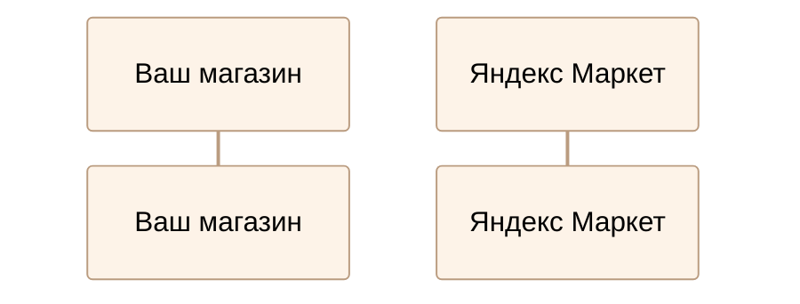

# Pirog
Ну какой еще сюда можно добавить заголовок?

# Mermaid

# Basic "About page" 

This is an example for basic documenation project.
It contains simple structure with couple of pages (this page, another page) and nested sub-section. 

Diplodoc provides you with unique name how this project can be reached on https://diplodoc.com like 
"https://common---gh-aje0e4eg9hffg001r5e5.viewer.diplodoc.com/en/" 

If you would like to extend your project - please refer to [YFM Project Organization guide](https://diplodoc.com/docs/en/project/)

All changes for this project can be done within you public github repository called "diplodoc-example/docs". 
To make changes and apply them: 

- go to your repo under "diplodoc-example/docs" 
- make changes for project structure or content
- commit & push into your repository 
- go to "Actions" tab for docs repository 
- run "Release" action and wait till completion 
- done, updates should be available for everyone. 

In case if you would like to make proxy from your own domain to this Documentation - please [Contact Us](https://diplodoc.com/#contact) - we will support you accordingly till appropriate documentation creation. 

