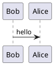

import markit from "markdown-it";
import plantuml from "markdown-it-plantuml-ex2";
const md = markit();
md.use(plantuml, options);

# Simple documentation project with YFM
## Header 2 level
Зима, холода, 
Одинокие дома,
Моря, города, 
Всё как будто изо льда


## Project Structure
Basic project contains few config files and pages with actual content. Both config files and markdown linked into the following structure:


```
input-folder
|-- .yfm (config file for whole project)
|-- toc.yaml (table of content)
|-- presets.yaml (presets for vairables)
|-- index.yaml (index page)
|-- pages (Content pages)
    |-- faq.md
    |-- how-to.md
|-- _assets (directory with pictures)
    |-- image1.png
    |-- image2.png
|-- _includes (directory for reusable content)
    |-- faq_shared_block.md
```



